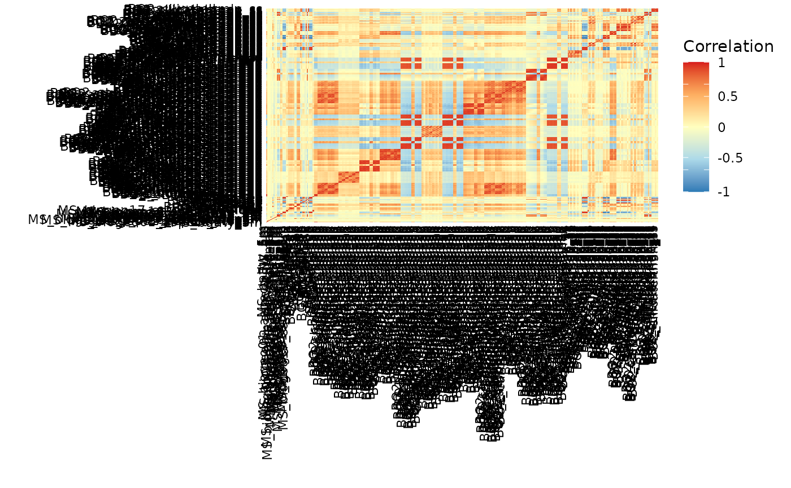

# sdmpredictors quickstart guide

The goal of sdmpredictors is to make environmental data, commonly used
for species distribution modelling (SDM), also called ecological niche
modelling (ENM) or habitat suitability modelling, easy to use in R. It
contains methods for getting metadata about the available environmental
data for the current climate but also for future and paleo climatic
conditions. A way to download the rasters and load them into R and some
general statistics about the different layers.

## Getting the metadata

Different list\_\* functions are available in order to find out which
datasets and environmental layers can be downloaded.

### list_datasets

With the *list_datasets* function you can view all the available
datasets. If you only want terrestrial datasets then you have to set the
marine parameter to FALSE and vice versa.

``` r

library(sdmpredictors)

# exploring the marine datasets 
datasets <- list_datasets(terrestrial = FALSE, marine = TRUE)
```

| dataset_code | terrestrial | marine | url | description | citation |
|:---|:---|:---|:---|:---|:---|
| Bio-ORACLE | FALSE | TRUE | <https://bio-oracle.org/> | Bio-ORACLE is a set of GIS rasters providing geophysical, biotic and environmental data for surface and benthic marine realms at a spatial resolution 5 arcmin (9.2 km) in the ESRI ascii and tif format. | Tyberghein L., Verbruggen H., Pauly K., Troupin C., Mineur F. & De Clerck O. Bio-ORACLE: a global environmental dataset for marine species distribution modeling. Global Ecology and Biogeography. doi: 10.1111/j.1466-8238.2011.00656.x |
| MARSPEC | FALSE | TRUE | <http://marspec.org/> | MARSPEC is a set of high resolution climatic and geophysical GIS data layers for the world ocean. Seven geophysical variables were derived from the SRTM30_PLUS high resolution bathymetry dataset. These layers characterize the horizontal orientation (aspect), slope, and curvature of the seafloor and the distance from shore. Ten “bioclimatic” variables were derived from NOAA’s World Ocean Atlas and NASA’s MODIS satellite imagery and characterize the inter-annual means, extremes, and variances in sea surface temperature and salinity. These variables will be useful to those interested in the spatial ecology of marine shallow-water and surface-associated pelagic organisms across the globe. Note that, in contrary to the original MARSPEC, all layers have unscaled values. | Sbrocco, EJ and Barber, PH (2013) MARSPEC: Ocean climate layers for marine spatial ecology. Ecology 94: 979. doi: 10.1890/12-1358.1 |

### list_layers

Using the *list_layers* function we can view all layer information based
on datasets, terrestrial (TRUE/FALSE), marine (TRUE/FALSE) and/or
whether it should be monthly data. The table only shows the first 4
columns of the first 3 layers.

``` r

# exploring the marine layers 
layers <- list_layers(datasets)
```

| dataset_code | layer_code | name | description |
|:---|:---|:---|:---|
| MARSPEC | MS_bathy_5m | Bathymetry | Depth of the seafloor |
| MARSPEC | MS_biogeo01_aspect_EW_5m | East/West aspect | East/West Aspect (sin(aspect in radians)) |
| MARSPEC | MS_biogeo02_aspect_NS_5m | North/South Aspect | North/South Aspect (cos(aspect in radians)) |

## Citing data

With the *dataset_citations* and *layer_citations* functions you can
fetch plain text or bibentries for the datasets and layers used,
allowing for proper citation of the data.

``` r

# print the Bio-ORACLE citation
print(dataset_citations("Bio-ORACLE"))
```

    ## [1] "Assis J, Tyberghein L, Bosch S, Heroen V, Serrão E, De Clerck O, Tittensor D (2018). \"Bio‐ORACLE v2.0: Extending marine data layers for\nbioclimatic modelling.\" _Global Ecology and Biogeography_, *27*(3),\n277-284. doi:10.1111/geb.12693 <https://doi.org/10.1111/geb.12693>."                                 
    ## [2] "Tyberghein L, Heroen V, Pauly K, Troupin C, Mineur F, De Clerck O (2012). \"Bio-ORACLE: a global environmental dataset for marine species\ndistribution modelling.\" _Global Ecology and Biogeography_, *21*(2),\n272-281. doi:10.1111/j.1466-8238.2011.00656.x\n<https://doi.org/10.1111/j.1466-8238.2011.00656.x>."

``` r

# print the citation for ENVIREM as Bibtex
print(lapply(dataset_citations("WorldClim", astext = FALSE), toBibtex))
```

    ## $WorldClim
    ## @Article{WorldClim,
    ##   author = {Robert J. Hijmans and Susan E. Cameron and Juan L. Parra and Peter G. Jones and Andy Jarvis},
    ##   title = {Very high resolution interpolated climate surfaces for global land areas.},
    ##   journal = {International Journal of Climatology},
    ##   year = {2005},
    ##   volume = {25},
    ##   number = {15},
    ##   pages = {1965-1978},
    ##   doi = {10.1002/joc.1276},
    ## }

``` r

# print the citation for a MARSPEC paleo layer
print(layer_citations("MS_biogeo02_aspect_NS_21kya"))
```

    ## [1] "Sbrocco EJ, Barber PH (2013). \"MARSPEC: ocean climate layers for marine spatial ecology.\" _Ecology_, *94*(4), 979. doi:10.1890/12-1358.1\n<https://doi.org/10.1890/12-1358.1>."                       
    ## [2] "Sbrocco EJ (2014). \"Paleo-MARSPEC: gridded ocean climate layers for the mid-Holocene and Last Glacial Maximum.\" _Ecology_, *95*(6), 1710.\ndoi:10.1890/14-0443.1 <https://doi.org/10.1890/14-0443.1>."

## Loading the data

### load_layers

To be able to use the layers you want in R you have to call the
*load_layers* function with

``` r

# download pH and Salinity to the temporary directory
load_layers(layers[layers$name %in% c("pH", "Salinity") & 
                     layers$dataset_code == "Bio-ORACLE",], datadir = tempdir())

# set a default datadir, preferably something different from tempdir()
options(sdmpredictors_datadir= tempdir())

# (down)load specific layers 
specific <- load_layers(c("BO_ph", "BO_salinity"))

# equal area data (Behrmann equal area projection) 
equalarea <- load_layers("BO_ph", equalarea = TRUE)
```

## Loading future and paleo data

Similarly to the current climate layers

``` r

# exploring the available future marine layers 
future <- list_layers_future(terrestrial = FALSE) 
# available scenarios 
unique(future$scenario) 
```

    ## [1] "A1B"   "A2"    "B1"    "RCP26" "RCP45" "RCP60" "RCP85"

``` r

unique(future$year)
```

    ## [1] 2100 2200 2050

``` r

paleo <- list_layers_paleo(terrestrial = FALSE)
unique(paleo$epoch) 
```

    ## [1] "Last Glacial Maximum" "mid-Holocene"

``` r

unique(paleo$model_name) 
```

    ## [1] "21kya_geophysical"      "21kya_ensemble_adjCCSM" "21kya_ensemble_noCCSM" 
    ## [4] "6kya_Ensemble"

Other functions related to layers metadata and future and paleo layers
are:

``` r

get_layers_info(c("BO_calcite","BO_B1_2100_sstmax","MS_bathy_21kya"))$common
```

    ##         time dataset_code        layer_code
    ## 462  current   Bio-ORACLE        BO_calcite
    ## 1337  future   Bio-ORACLE BO_B1_2100_sstmax
    ## 101    paleo      MARSPEC    MS_bathy_21kya
    ##                                                             layer_url
    ## 462                    https://bio-oracle.org/data/1.0/BO_calcite.zip
    ## 1337            https://bio-oracle.org/data/1.0/BO_B1_2100_sstmax.zip
    ## 101  https://www.lifewatch.be/sdmpredictors/MS_bathy_21kya_lonlat.tif

``` r

# functions to get the equivalent future layer code for a current climate layer 
get_future_layers(c("BO_sstmax", "BO_salinity"), 
                  scenario = "B1", 
                  year = 2100)$layer_code 
```

    ## [1] "BO_B1_2100_salinity" "BO_B1_2100_sstmax"

``` r

# functions to get the equivalent paleo layer code for a current climate layer 
get_paleo_layers(c("MS_bathy_5m", "MS_biogeo13_sst_mean_5m"), 
                 model_name = c("21kya_geophysical", "21kya_ensemble_adjCCSM"), 
                 years_ago = 21000)$layer_code 
```

    ## [1] "MS_bathy_21kya"                     "MS_biogeo13_sst_mean_21kya_adjCCSM"

## Statistics

Two types of statistics are available for the current climate layers:

- individual layer statistics
  - summary statistics (minimum, q1, median, q3, maximum, mad, mean and
    sd)
  - spatial autocorrelation (Moran’s I and Geary’s C)
- Pearson correlation coefficient between the different layers and their
  quadratic

``` r

# looking up statistics and correlations for marine annual layers
datasets <- list_datasets(terrestrial = FALSE, marine = TRUE)
layers <- list_layers(datasets)

# filter out monthly layers
layers <- layers[is.na(layers$month),]

layer_stats(layers)[1:2,]
```

    ##      layer_code minimum    q1 median    q3 maximum      mad      mean       sd
    ## 26  BO_bathymax   -9906 -4748  -3948 -2784    2361 1361.027 -3525.239 1651.386
    ## 27 BO_bathymean  -10494 -4876  -4098 -3005    1721 1307.653 -3675.429 1645.478
    ##        moran      geary
    ## 26 0.9670128 0.01461685
    ## 27 0.9706400 0.01073758

``` r

correlations <- layers_correlation(layers)

# create groups of layers where no layers in one group 
# have a correlation > 0.7 with a layer from another group 
groups <- correlation_groups(correlations, max_correlation=0.7)

# group lengths
sapply(groups, length)
```

    ##  [1]  4  1  1  1  2 41  1  1 24  2  4  1 34  1 18 60  9 24  6  3 12 17  2  2  2
    ## [26]  2

``` r

for(group in groups) {
  if(length(group) > 1) {
    cat(paste(group, collapse =", "))
    cat("\n")
  }
}
```

    ## MS_bathy_5m, BO_bathymin, BO_bathymax, BO_bathymean
    ## MS_biogeo04_profile_curvature_5m, MS_biogeo07_concavity_5m
    ## BO_cloudmax, BO_cloudmean, BO_cloudmin, MS_biogeo13_sst_mean_5m, MS_biogeo14_sst_min_5m, MS_biogeo15_sst_max_5m, BO_dissox, BO_nitrate, BO_parmax, BO_parmean, BO_phosphate, BO_sstmax, BO_sstmean, BO_sstmin, BO2_templtmax_ss, BO2_templtmin_ss, BO2_tempmax_ss, BO2_tempmean_ss, BO2_tempmin_ss, BO2_dissoxmax_ss, BO2_dissoxmean_ss, BO2_dissoxmin_ss, BO2_dissoxltmax_ss, BO2_dissoxltmin_ss, BO2_nitratemax_ss, BO2_nitratemean_ss, BO2_nitrateltmax_ss, BO2_phosphatemax_ss, BO2_phosphatemean_ss, BO2_phosphatemin_ss, BO2_phosphateltmax_ss, BO2_phosphateltmin_ss, BO2_nitratemin_ss, BO2_nitrateltmin_ss, BO_silicate, BO2_silicatemax_ss, BO2_silicatemean_ss, BO2_silicatemin_ss, BO2_silicaterange_ss, BO2_silicateltmax_ss, BO2_silicateltmin_ss
    ## MS_biogeo08_sss_mean_5m, MS_biogeo09_sss_min_5m, MS_biogeo10_sss_max_5m, BO_salinity, BO2_salinitymax_bdmax, BO2_salinitymax_bdmean, BO2_salinitymax_bdmin, BO2_salinitymean_bdmax, BO2_salinitymean_bdmean, BO2_salinitymean_bdmin, BO2_salinitymin_bdmax, BO2_salinitymin_bdmean, BO2_salinitymin_bdmin, BO2_salinityltmax_bdmax, BO2_salinityltmax_bdmean, BO2_salinityltmax_bdmin, BO2_salinityltmin_bdmax, BO2_salinityltmin_bdmean, BO2_salinityltmin_bdmin, BO2_salinitymax_ss, BO2_salinitymean_ss, BO2_salinitymin_ss, BO2_salinityltmax_ss, BO2_salinityltmin_ss
    ## MS_biogeo11_sss_range_5m, MS_biogeo12_sss_variance_5m
    ## MS_biogeo16_sst_range_5m, MS_biogeo17_sst_variance_5m, BO_sstrange, BO2_temprange_ss
    ## BO_chlomax, BO_chlomean, BO_chlomin, BO_chlorange, BO_damax, BO_damean, BO_damin, BO2_ironmax_bdmax, BO2_ironmax_bdmean, BO2_ironmax_bdmin, BO2_ironmean_bdmax, BO2_ironmean_bdmean, BO2_ironmean_bdmin, BO2_ironmin_bdmax, BO2_ironmin_bdmean, BO2_ironmin_bdmin, BO2_ironrange_bdmax, BO2_ironrange_bdmean, BO2_ironrange_bdmin, BO2_ironltmax_bdmax, BO2_ironltmax_bdmean, BO2_ironltmax_bdmin, BO2_ironltmin_bdmax, BO2_ironltmin_bdmean, BO2_ironltmin_bdmin, BO2_carbonphytomax_bdmax, BO2_salinityrange_bdmean, BO2_salinityrange_bdmin, BO2_ironmax_ss, BO2_ironmean_ss, BO2_ironmin_ss, BO2_ironltmax_ss, BO2_ironltmin_ss, BO2_ironrange_ss
    ## BO2_curvelmax_bdmax, BO2_curvelmax_bdmean, BO2_curvelmax_bdmin, BO2_curvelmin_bdmax, BO2_curvelmin_bdmean, BO2_curvelltmax_bdmax, BO2_curvelltmax_bdmean, BO2_curvelltmax_bdmin, BO2_curvelltmin_bdmax, BO2_curvelmean_bdmean, BO2_curvelmean_bdmin, BO2_curvelmin_bdmin, BO2_curvelltmin_bdmean, BO2_curvelltmin_bdmin, BO2_curvelmean_bdmax, BO2_curvelrange_bdmax, BO2_curvelrange_bdmean, BO2_curvelrange_bdmin
    ## BO2_dissoxmax_bdmax, BO2_dissoxmax_bdmean, BO2_dissoxmax_bdmin, BO2_dissoxmean_bdmax, BO2_dissoxmean_bdmean, BO2_dissoxmean_bdmin, BO2_dissoxmin_bdmax, BO2_dissoxmin_bdmean, BO2_dissoxmin_bdmin, BO2_dissoxltmax_bdmax, BO2_dissoxltmax_bdmean, BO2_dissoxltmax_bdmin, BO2_dissoxltmin_bdmax, BO2_dissoxltmin_bdmean, BO2_dissoxltmin_bdmin, BO2_phosphatemax_bdmax, BO2_phosphatemax_bdmean, BO2_phosphatemax_bdmin, BO2_phosphatemean_bdmax, BO2_phosphatemean_bdmean, BO2_phosphatemean_bdmin, BO2_phosphatemin_bdmax, BO2_phosphatemin_bdmean, BO2_phosphatemin_bdmin, BO2_phosphateltmax_bdmax, BO2_phosphateltmax_bdmean, BO2_phosphateltmax_bdmin, BO2_phosphateltmin_bdmax, BO2_phosphateltmin_bdmean, BO2_phosphateltmin_bdmin, BO2_nitratemax_bdmax, BO2_nitratemax_bdmean, BO2_nitratemax_bdmin, BO2_nitratemean_bdmax, BO2_nitratemean_bdmean, BO2_nitratemean_bdmin, BO2_nitratemin_bdmax, BO2_nitratemin_bdmean, BO2_nitratemin_bdmin, BO2_nitrateltmax_bdmax, BO2_nitrateltmax_bdmean, BO2_nitrateltmax_bdmin, BO2_nitrateltmin_bdmax, BO2_nitrateltmin_bdmean, BO2_nitrateltmin_bdmin, BO2_silicatemax_bdmax, BO2_silicatemax_bdmean, BO2_silicatemax_bdmin, BO2_silicatemean_bdmax, BO2_silicatemean_bdmean, BO2_silicatemean_bdmin, BO2_silicatemin_bdmax, BO2_silicatemin_bdmean, BO2_silicatemin_bdmin, BO2_silicateltmax_bdmax, BO2_silicateltmax_bdmean, BO2_silicateltmax_bdmin, BO2_silicateltmin_bdmax, BO2_silicateltmin_bdmean, BO2_silicateltmin_bdmin
    ## BO2_dissoxrange_bdmax, BO2_dissoxrange_bdmean, BO2_dissoxrange_bdmin, BO2_phosphaterange_bdmax, BO2_phosphaterange_bdmean, BO2_phosphaterange_bdmin, BO2_nitraterange_bdmax, BO2_nitraterange_bdmean, BO2_nitraterange_bdmin
    ## BO2_lightbotmax_bdmax, BO2_lightbotmean_bdmax, BO2_lightbotmean_bdmean, BO2_lightbotmin_bdmax, BO2_lightbotrange_bdmax, BO2_lightbotltmax_bdmax, BO2_lightbotltmax_bdmean, BO2_lightbotltmin_bdmax, BO2_tempmax_bdmax, BO2_tempmax_bdmean, BO2_tempmax_bdmin, BO2_tempmean_bdmax, BO2_tempmean_bdmean, BO2_tempmean_bdmin, BO2_tempmin_bdmax, BO2_tempmin_bdmean, BO2_tempmin_bdmin, BO2_templtmax_bdmax, BO2_templtmax_bdmean, BO2_templtmax_bdmin, BO2_templtmin_bdmax, BO2_templtmin_bdmean, BO2_templtmin_bdmin, BO2_carbonphytomin_bdmin
    ## BO2_lightbotmax_bdmin, BO2_lightbotmean_bdmin, BO2_lightbotrange_bdmin, BO2_lightbotltmax_bdmin, BO2_lightbotltmin_bdmin, BO2_lightbotmin_bdmin
    ## BO2_silicaterange_bdmax, BO2_silicaterange_bdmean, BO2_silicaterange_bdmin
    ## BO2_icecoverltmax_ss, BO2_icecovermax_ss, BO2_icecovermean_ss, BO2_icecoverrange_ss, BO2_icethickltmax_ss, BO2_icethickmax_ss, BO2_icethickrange_ss, BO2_icecoverltmin_ss, BO2_icethickmean_ss, BO2_icecovermin_ss, BO2_icethickltmin_ss, BO2_icethickmin_ss
    ## BO2_chlomax_ss, BO2_chlomean_ss, BO2_chlorange_ss, BO2_chloltmax_ss, BO2_chloltmin_ss, BO2_carbonphytomax_ss, BO2_carbonphytomean_ss, BO2_carbonphytorange_ss, BO2_carbonphytoltmax_ss, BO2_ppltmax_ss, BO2_ppmax_ss, BO2_ppmean_ss, BO2_pprange_ss, BO2_carbonphytomin_ss, BO2_carbonphytoltmin_ss, BO2_ppmin_ss, BO2_ppltmin_ss
    ## BO2_curvelmax_ss, BO2_curvelltmax_ss
    ## BO2_curvelmean_ss, BO2_curvelrange_ss
    ## BO2_curvelmin_ss, BO2_curvelltmin_ss
    ## BO2_phosphaterange_ss, BO2_nitraterange_ss

``` r

# plot correlations (requires ggplot2)
plot_correlation(correlations)
```


